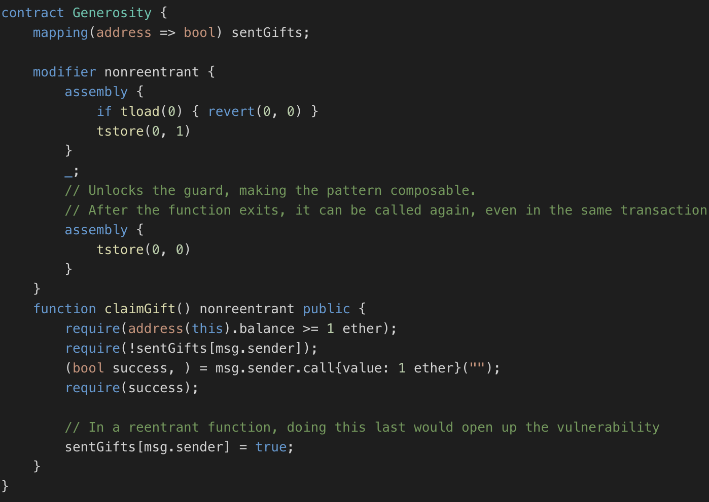

## Transient Storage Opcodes in Solidity 0.8.24
**Posted on: 2024-09-18**

Solidity 0.8.24 supports the opcodes included in the upcoming Cancun hardfork and, in particular, the transient storage opcodes TSTORE and TLOAD as per EIP-1153.

Transient storage is a long-awaited feature on the EVM level that introduces another data location besides memory, storage, calldata (and return-data and code). The new data location behaves as a key-value store similar to storage with the main difference being that data in transient storage is not permanent, but is scoped to the current transaction only, after which it will be reset to zero. Consequently, transient storage is as cheap as warm storage access, with TSTORE and TLOAD priced at 100 gas.

Users should note that the compiler does not yet allow using transient as a data location in high-level Solidity code. For the time being, data stored in this location can only be accessed using the TSTORE and TLOAD opcodes in inline assembly.

An expected canonical use case for transient storage is cheaper reentrancy locks, which can be readily implemented with the opcodes as showcased below. However, given the caveats mentioned in the specification of EIP-1153, utmost care has to be taken for more advanced use cases of transient storage to preserve the composability of your smart contract. To raise awareness of this issue, for the time being, the compiler will emit a warning on use of tstore in assembly.

## Bug in Deduplication of Verbatim Blocks
**Posted on: 2024-09-18**

On October 24, Ori Pomerantz reported a bug affecting the use of verbatim builtin in Yul code. After investigating, the team was able to confirm the problem and locate its origin. The bug existed in the Block Deduplicator optimizer step, wherein equivalent assembly blocks are identified and merged. verbatim assembly items surrounded by identical opcodes were incorrectly considered identical and unified.

The bug existed since version 0.8.5, which introduced verbatim, and only affected pure Yul compilation with optimization enabled. Solidity code or Yul used in inline assembly blocks would not trigger it.

The use of verbatim is uncommon and the conditions which trigger the bug (two or more verbatim items surrounded by identical opcodes) are very specific. Also, to the extent of the investigations made by the team, there is no evidence that this could be used as an exploit or attack vector. While, if present, the impact of the bug is severe, its likelihood is very low. Considering that, the team assigned the bug an overall score of low.

Which Contracts Are Affected?
The conditions under which the bug might be triggered are as follows:

1. Compilation of pure Yul code.
2. Multiple calls to verbatim builtins with different data.
3. Block Deduplicator optimizer step being in use.

Note that the Block Deduplicator is enabled by default when the optimizer is enabled.

If your project does not include contracts written purely in Yul or does not use verbatim, then there is no risk of it being impacted.

## FullInliner Non-Expression-Split Argument Evaluation Order Bug
**Posted on: 2024-09-18**

On July 4, 2023, Robert Chen from OtterSec discovered a bug in the Yul optimizer.

The earliest affected version of the compiler is 0.6.7, which introduced the ability to modify the optimizer step sequence. Solidity version 0.8.21, released on July 19, 2023, provides a fix.

We assigned the bug an overall score of "low". The bug has "high" severity in affected cases, but we deem the likelihood of it actually affecting deployed contracts as "very low".

* The prerequisite to trigger the bug is to meet all of the following conditions:

* The use of Yul optimizer.

* The use of a custom optimizer step sequence.

* Presence of the FullInliner step (i) in the sequence.

* Code in non-expression-split form being able to reach the FullInliner step.

It is not generally possible for the user to precisely control whether the code coming out of the code generator is or is not in this form. However, it is guaranteed that the code passed through the ExpressionSplitter step (x) is expression-split, and the opposite is true for code that is run through the ExpressionJoiner step (j). Therefore sequences where i is always preceded by x with no intervening occurrences of j are safe. Other sequences may or may not be affected depending on their exact structure.

Lack of user-provided Yul code (in the form of inline assembly or pure Yul input) significantly decreases the chances of triggering the bug.